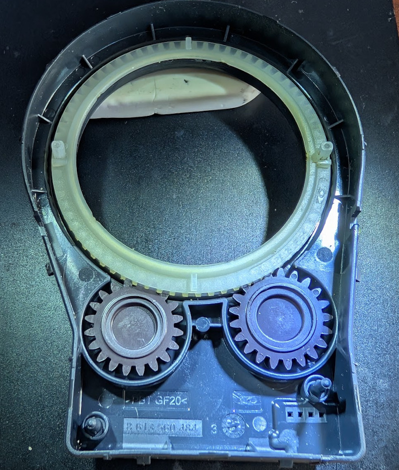
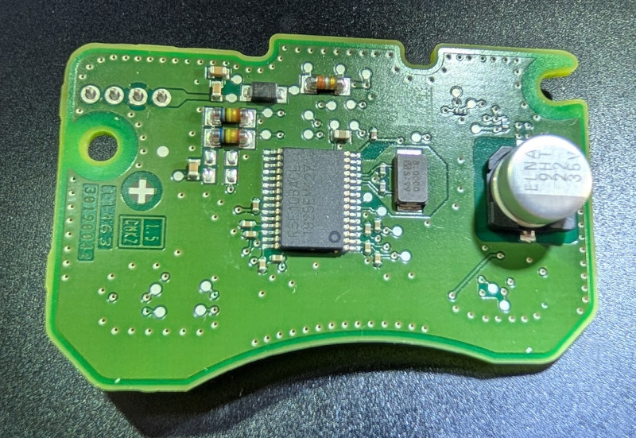
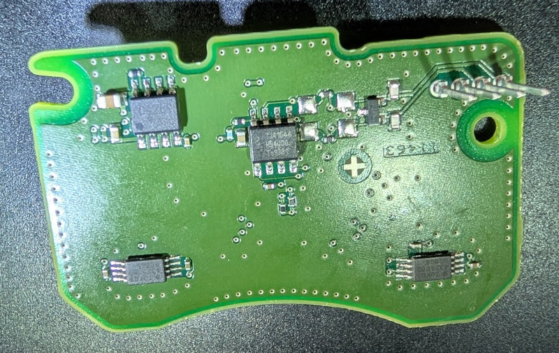
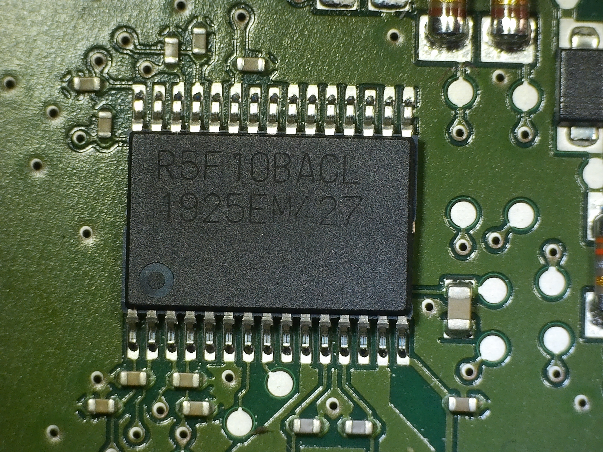
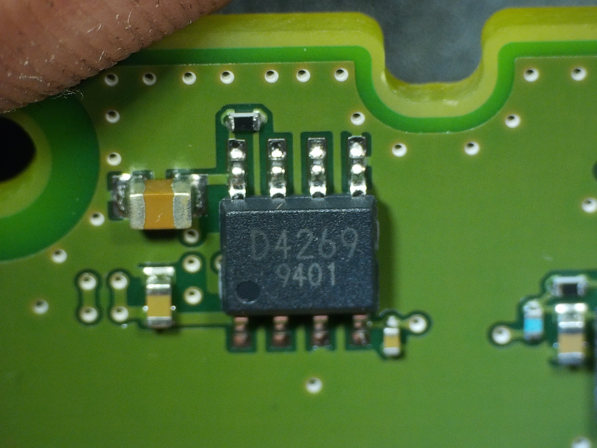
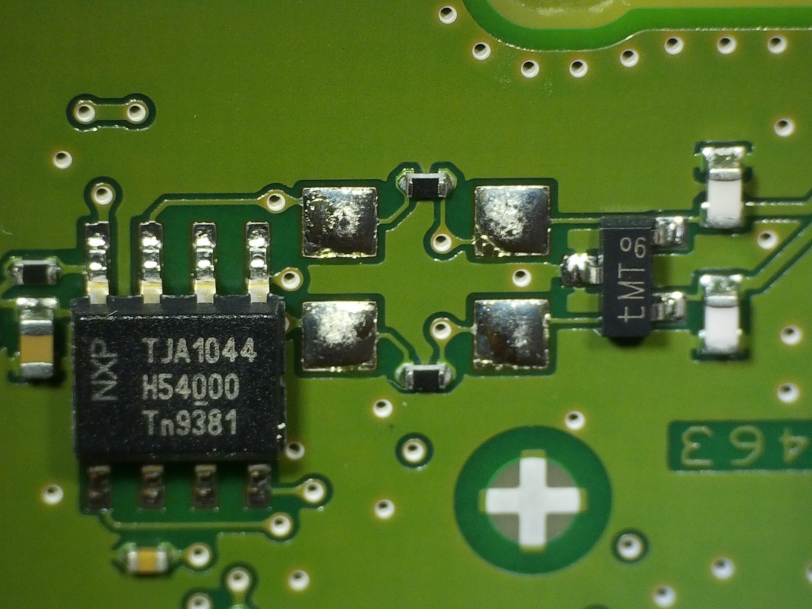

# Аппаратное устройство датчика с номером 0 265 019 153

Датчик сделан по тому же принципу, отличаются примененные микросхемы и количество зубьев на шестернях. Маленькие шестерни имеют 20 и 21 зуб, большая 70.

Общий вид платы с двух сторон:

## MCU

Микроконтроллер RL78/F13 Renesas Electronics. SSOP-30, 32 КБ Flash-памяти (+ 2 КБ RAM).

## Питание

Питание сделано на LDO TLE4269

## CAN

CAN transceiver NXP TJA 1044

## Цифровой магнитный датчик 

Угол поворота шестерней определяется при помощи микросхемы TDK TAD2141

