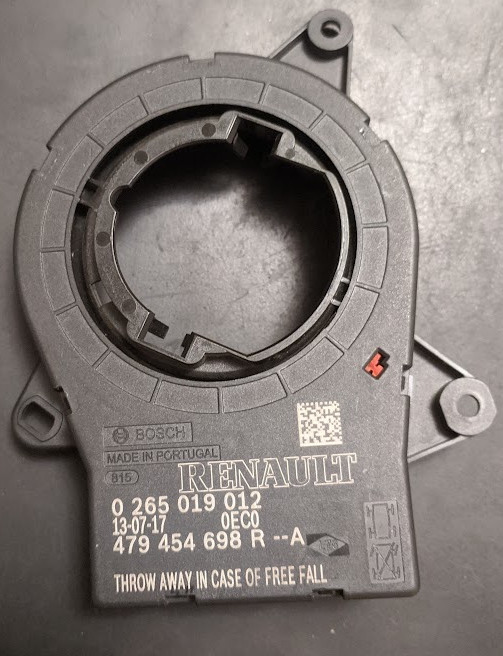
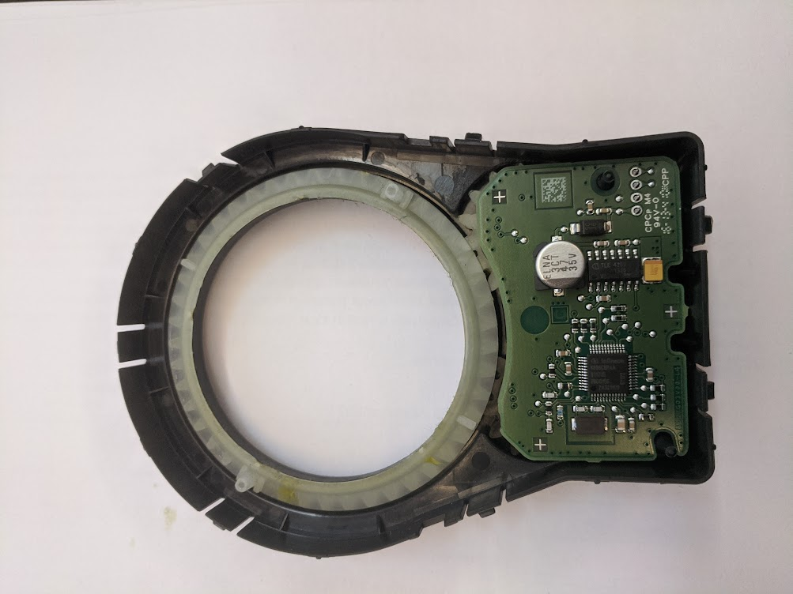
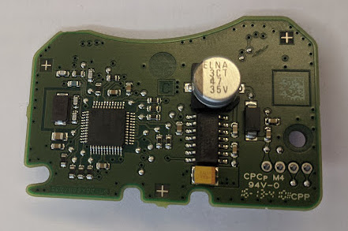
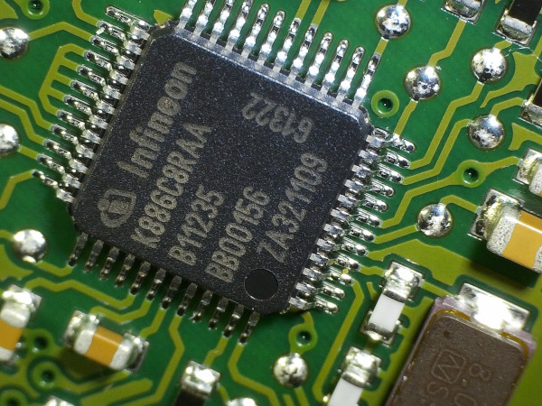
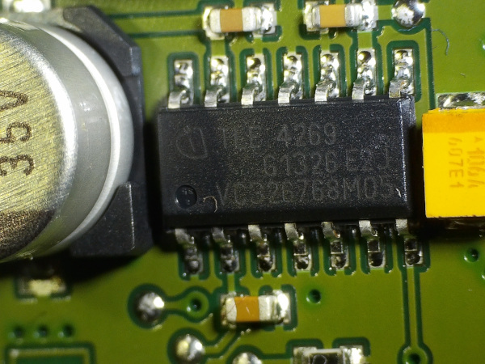
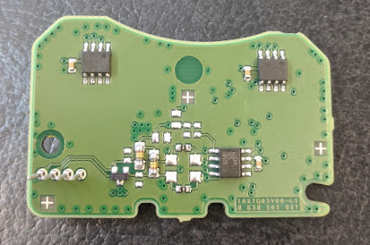
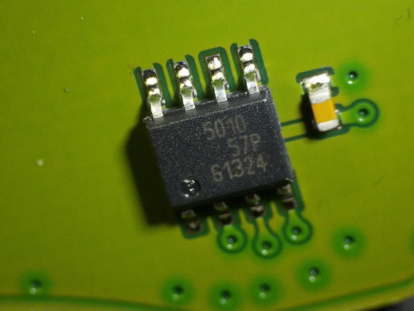
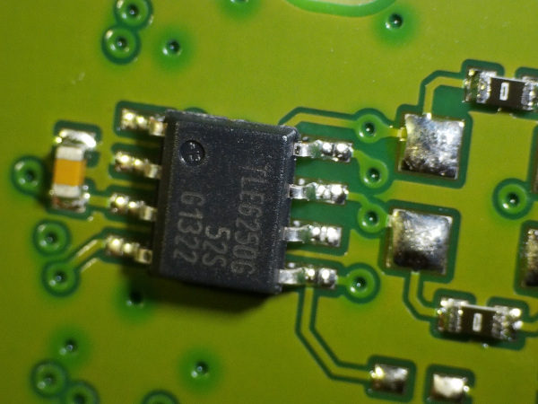
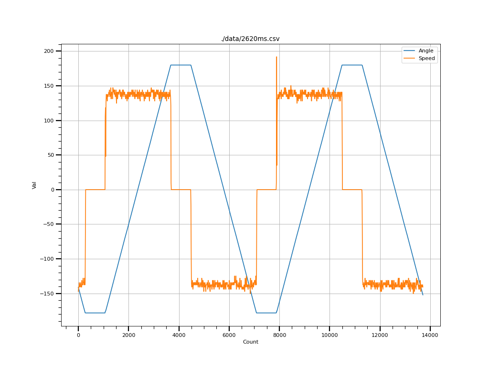
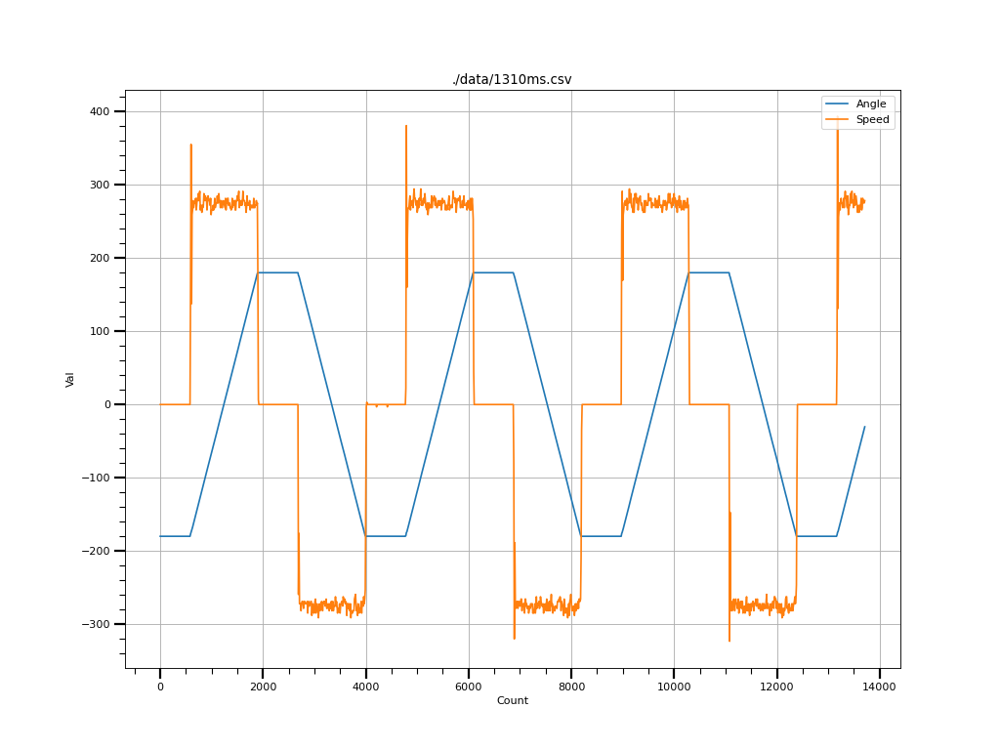

# Датчик угла поворота руля Renault



Данный датчик применяется на автомобилях Lada Vesta, Renault Logan 2, Renault Sandero. Существует несколько модификаций, с отличающимися номерами, но выполнеными в одном корпусе.

## Устройство

Фото устройства датчика с номером 0 265 019 012.





Сверху на плате установлен микроконтроллер от Infineon. Предположительно, 8-битный контроллер серии XC886. 



[Даташит](./DS/xc880/Infineon-XC88XCLM-DS-v01_02-en.pdf) на микроконтроллер и другие доступные документы с сайта Infineon находятся в папке DS.

Питание сделано на [микросхеме TLE 4269](./DS/Infineon-TLE4269-DS-v02_60-EN.pdf)





На нижней стороне платы установлены два датчика магнитного поля [TLE 5010](./DS/tle5010.pdf)



и CAN транссивер [TLE 6250](./DS/TLE6250.pdf)



## Принцип работы

Большая шестерня (45 зубов) соединена с рулевым валом и вращает две маленьких шестеренки разного размера. В зависимости от модификации датчика количество зубов может отличаться, но прицип тот же. В данном случае, шестеренки на 15 и 13 зубов. В центре маленьких шестеренок установлены магниты. На нижней стороне платы, над шестеренками расположены датчики магнитного поля [TLE 5010](./DS/tle5010.pdf). Из-за разного размера шестеренок, они вращаются с разной скоростью. Зубья подобраны так, что комбинация углов поворота этих шестеренок уникальна в перделах 4.3 оборота большой шестеренки (и рулевого вала). Таким образом, нет необходимости сохранять угол при отключении питания, по углам поворота маленьких шестеренок можно однозначно определить угол поворота большой.

[Пример расчета углов поворота](https://docs.google.com/spreadsheets/d/1gZw_lk60fOd_avz0FDlKBPVdTQlWQ1hZesvFYzQUca8/edit?usp=sharing). Можно увидеть, что маленькие шестерни (15 и 13 зубов) вернутся в положение 0-0 через 1560 градусов поворота рулевого вала, или через 4.3 оборота.

## Протокол обмена

Датчик шлет CAN сообщение с ID 0x0C2 с периодом 10ms. Сообщение из 7 байт. Скорость CAN - 500 кб/с.

| ID    | 0x0C2 |
| -------- | ------- |
| 0 | Angle_HI    |
| 1 | Angle_LOW     |
| 2 | Speed_HI    |
| 3 | Speed_LOW    |
| 4 | Heartbeat    |
| 5 | Flags    |
| 6 | CRC    |

В первых двух байтах содержится значение угла поворота. Значение 16-битное, смещено на 0x8000 и умножено на 10. Формула для получения значения угла: (X-32768)/10

Значение угла поворота может изменяться от -780 градусов до +780 градусов. Т.е. максимум это 1560 градусов вращения или 4.3 оборота. Если привысить это значение, датчик переходит в режим ошибки и вместо значения угла и скорости вращения выдает значения 0xFFFF до сброса питания.

Во вторых двух байтах (с индексом 2 и 3) содержится скорость вращения. Значение 16-битное, записано так же как и скорость - смещение на 0x8000 и умножено на 10.

Пример построения графика при различных скоростях вращения:



На графике синяя линия это угол поворота. Меняется от -180 до 180 градусов. Оранжевая линия это скорость вращения. Полный оборот на этом графике занимает 2620 мс. 360 градусов за 2.62 секунды, это 137.4 градуса в секунду.

График с вращением в два раза быстрее, оборот за 1310 мс:



360 градусов за 1.31 секунды это 274.8 градуса в секунду.

В байте с индексом 4 в старших 4-х битах находится какой-то статус датчика, а в младших номер посылки. Когда датчик в нормальном состоянии значения последовательно меняются от 0 до 0xF и дальше опять от 0. Когда датчик в состоянии ошибки значения меняются от 0x40 до 0x4F и дальше опять от 0x40.

В байте с индексом 5 находятся какие-то флаги. В нормальном состоянии этот байт равен 0, в состоянии ошибки - 0x0B.

Последний байт содержит контрольную сумму 6 байт данных. Алгоритм:

```
u_int8_t sas_crc(u_int8_t *data, int len){
	u_int8_t summ = 0;

	for(u_int32_t i=0; i<len; i++){
		summ += *data++;
	}

	summ = 255 - summ;
	return summ;
}
```

В папке img/Microscope находятся фотографии платы под микроскопом.

В папке sas_test пример разбора данных и скрипты для запуска vcan.
